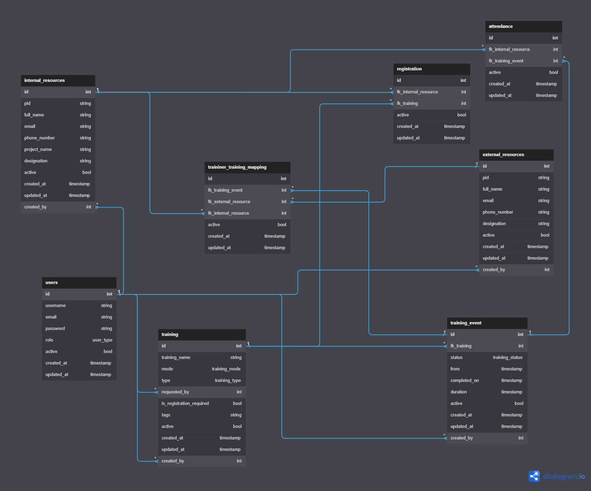

# classroom



- This project created to be used as a starter template.
- Overview
  - Goose to Write MYSQL code with versioning.
    - Create a `<int>_<name>.sql` file. and run `bash do.sh migrate`.
    - Goose will run the .sql file and apply changes, In active database.
    - This way we can keep track of changes to database.
    - Goose will only run new Files. It keeps track of what files have ran in database table called `goose_db_version`.
  - Custom generated code using go-template, by reading MYSQL, Generate following files
    - **By reading Enums:**
      - Create an `uint16` extended type, by enumName.
      - Create contants by `name`+`type` using `itoa` to have int value starting from 0.
      - Create Methods on extended type, so it will implement
        - `graphql.Marshaler` -> So that enum can be Marshal and UnMarshal by gqlgen from Graphql query, as enums are scalar type in .graphql files.
        - `sql/driver.Valuer` and `database/sql.Scanner` -> So that 'repository' can perform *Insert* and *Select* Operations on the enum column.
    - **By reading Table:**
      - Create Table struct with all fields and `json:"<column_name>" db:"<column_name>"` to map object to json and db
      - Create CreateTable struct with all fields except (`id`, `created_at`, `updated_at` and `active`) <br>
              All fields will be mandetory
      - Create UpdateTable struct with all fields except (`id`, `created_at`, `updated_at`) <br>
              All fields will be opional, denoted by pointer which can be null.
      - Create TableFilter struct for all columns, each column will have type `FilterOnField`, and Some additionalFilters like where, joins etc.
      - Create A ListTable object, and some helper function on the ListTable struct. <br>
        - Filter and Find function.
        - GetSpecificColumn as a list.
        - By reading `indexes` a `MapBy` function, which will return Map with key as index column, and value as ListTable if non unique or Table if Unique.
    - **To read Indexes:**
      - We read indexes created on table.
      - Multi column indexes are expnded.
        - A multi-column index can still be effective even if you are only searching by a single column that is part of index
        - For example if you create an index on column (A, B, C). Mysql will create 3 seperate index (A), (A, B), (A, B, C)

      ```json
      // --> input
      {
        name: "hello"
        id: 1,
        unique: true,
        columns: [
          {name: col1, no: 1},
          {name: col1, no: 2},
          {name: col1, no: 3},
        ]
      }
      
      // --> output
      {
        name: "hello"
        id: 1,
        unique: true,
        columns: [
          {name: col1, no: 1},
          {name: col1, no: 2},
          {name: col1, no: 3},
        ]
      }
      {
        name: "hello"
        id: 1,
        unique: true,
        columns: [
          {name: col1, no: 1},
        ]
      }
      {
        name: "hello"
        id: 1,
        unique: true,
        columns: [
          {name: col1, no: 1},
          {name: col1, no: 2},
        ]
      }

      ```

    - **To Read ForeignKeys:**
      - We read all the foreignKeys for each table
      - each Foreign Key have following data:

        ```go
        type ForeignKey struct {
          ForeignKeyName string // the constrain name
          ColumnName     string // column containing the foreign key, usually starts with 'fk_'
          RefTableName   string // The table name it reffers to
          RefColumnName  string // the ref table Column to with the key points to, usually 'id' column    

          Column Column // column struct
          RefColumn Column // ref column struct
          RefTable Table // ref table struct
        }
        ```

      - After accumulating foreign keys for evey table. <br>
        For each table, we find what other tables are have foreign keys pointing to this table.
      - When This Table Pointing to Other Table!!!, ManyToOne <- As Many records from other table can point to this table one record
      - When other Table Pointing to This Table!!!, OneToMany <- As This Table record can point to Multiple Other table record

    - **To generate Repos**:
      - 
    - **To generate rlts**:
      - 

## XO

- **Architecture (TODO)**

## Backend

- **SQL first architecture and Goose:**
  - We start with writing SQL, And then the entities are generated by `xo` on reading the database. That's why I called It sql first.

- **gqlgen and schema first approch**
  - We are using Gqlgen to generate code to connect quries to functions.
  - Gqlgen is a schema first and not code first.
  - So you write the schema.graphql file and the entites can be auto generated by gqlgen.
  - But here we are creating *our own* graphql schema **and** go entities. <br>
  - We create our own custom model instead of auto-generating, As we want to have [custom resolvers](https://gqlgen.com/#how-do-i-prevent-fetching-child-objects-that-might-not-be-used) for foregin keys. SO that database will query only if requested.

- **Go Mod:**
  - As go mod uses direct URLs. And we are using our own library `xo`, <br> Each time we update `xo` we have to push it to github, so that `backend` can `go mod tidy` lattest version.
  - Above problem is solved by adding following in go.mod file. <br>
      So that we are pointing to local files, so go mod does not query the web.

    ```
    replace github.com/ketan-10/classroom/xo => /home/ketan/go/src/classroom/xo
    ```

- **golang**
  - [Learn Go Programming - Golang Tutorial for Beginners](https://www.youtube.com/watch?v=YS4e4q9oBaU)
  - [The Flaws of Inheritance](https://youtu.be/hxGOiiR9ZKg)
  - Dependency
    - Go Does not allow cyclic dependency, it gives error as `import cycle not allowed` <br>
        Though interpreted language like python support it on some level [Example 👆](https://stackoverflow.com/a/744410/10066692) <br>
        I think it should have been possible with [linking step like in C++](https://www.youtube.com/watch?v=H4s55GgAg0I&list=PLlrATfBNZ98dudnM48yfGUldqGD0S4FFb&index=7)

    - [Go team approach to from Dependency management tool before `go mod` or `go dep` on Medium](https://medium.com/@sdboyer/so-you-want-to-write-a-package-manager-4ae9c17d9527)
  - Tools
    - We can install dev-tools using go mod.
    - Go does not support dev-dependency.
    - So to avoid tools to end up in prod executable. We add `// +build tools` at top, <br>
        So that they will be only included if we build code with `+ tools` while building/

    - For dev-dependency go recommend following ([Github Issue](https://github.com/golang/go/issues/25922#issuecomment-1038394599)).

    - for example:

        ```go
        //go:build tools
        // +build tools

        package tools

        import (
            _ "github.com/99designs/gqlgen"
        )
        ```

    - After tools are setup we can run Run: **`go run github.com/99designs/gqlgen <command>`**

- **Filters**
  - Here we provide functionality to add filters, So the graqhql query with filters. <br>
    In below example we are using filter with id in findAllUser <br>
    Also we are fetching internal resources created by user, there we add filter for `projectName` <br>
    So internalResouces will be fetched by "created by userId: `2`, `3`, `4` **and** with projectName: `abc`"

    ```graphql
    query findusers {
      findAllUser(filter: {
        id: {
          gt: 1
          lt: 5
        }
      }) {
        totalCount
        data {
          username
          internalResourcesByCreatedBy(
            filter: {
              projectName: "abc"
            }
          ) {
            data {
              name
            }
          }    
        }
      } 
    }
    ```

  - When generating graphql files we provide

    ```graphql
    scalar FilterOnField
    ```

    Scalar can have any value.

  - We have to explicitly provide `MarshalGQL` and `UnmarshalGQL` for this in attached go model (provided in `gqlgen.yml` under models), <br>
    By implementing graphql.Marshaler interface.
  
  - FilterOnField is Marshaled into go type:
  
  ```go
    type FilterOnField []map[FilterType]interface{}

    type FilterType string 
    // enum of 'eq', 'neq', 'gt', 'gte', 'lt', 'lte', 'like', 'between' 
  ```

  - Example of possible filter on a column, it will fetch if column value is `8` or `9`

  ```js
    FilterOnField = [
      {
        "gt": 5,
        "lt": 10
      },
      {
        "gt": 7
      }
    ]
  ```

  - In graphql query we only specify **one** `map[FilterType]interface{}`, but we use it's **Array** to applyFilter, due to we might use multiple filter in sevices or resolver in golang code.

  - All filters are consolidated as `sq.And` and applied on `SelectBuild.where()` in AddFilter.

  - Also We have additional filter like (`Where`, `Join`, `LeftJoin`, `GroupBy`, `Having`) which are applied in `AddAdditionalFilter` method. by converting to sql string and passed to query builder.

- **Pagination** (TODO)
- **wire** (TODO)
- **Login service** (TODO)
- **Custom Resolvers** (TODO)
- **Middleware and graphql Directives/Annotation Middleware** (TODO)
